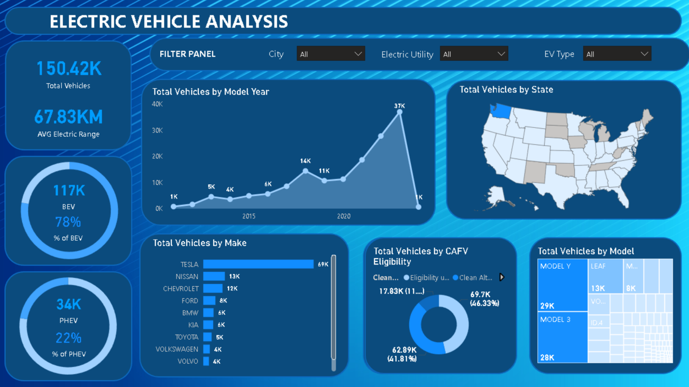

# **EV Population Analysis**  

## **Project Overview**  
This project analyzes Electric Vehicle (EV) adoption trends, including total vehicles, market share by manufacturer, model distribution, and geographic concentration. The goal is to gain insights into EV growth, preferences, and policy impact.

**Dataset Source & Credits:** [EV Population Dataset](https://www.youtube.com/watch?v=qjjt87YoOMg)  

## **Objectives**  
- Understand EV adoption trends over time.
- Identify top EV manufacturers and models.
- Analyze regional EV distribution.
- Examine Clean Alternative Fuel Vehicle (CAFV) eligibility impact.

## **Project Structure**  

### **1. Data Collection & Preprocessing**  
- The dataset was gathered from a YouTube video by **DataTutorials**.  
- Performed necessary data cleaning, including handling missing values and standardizing formats.  
- Filtered the dataset to focus on Battery Electric Vehicles (BEV) and Plug-in Hybrid Electric Vehicles (PHEV).  

### **2. Data Analysis**  
- **EV Growth Over Time:** The data shows a steady increase in EV adoption, peaking in **2022 with 37K vehicles**, followed by a sharp decline. Possible reasons include supply chain issues or policy shifts.
- **Market Share by Manufacturer:** Tesla dominates the EV market with **69K vehicles**, significantly ahead of Nissan (**13K**) and Chevrolet (**12K**). 
- **BEV vs. PHEV Distribution:** BEVs account for **78%** of total EVs, showing a clear consumer preference for full-electric vehicles over hybrids.
- **CAFV Eligibility:** A substantial **46.33% (69.7K vehicles)** qualify for clean alternative fuel incentives, highlighting the role of government programs in EV adoption.

### **3. Data Visualization & Interpretation**  
The dashboard below presents key EV adoption insights, including growth trends, market share, geographic distribution, and eligibility for clean energy incentives.

## **Findings**  
- The EV market has seen rapid growth, with **Tesla leading in both brand and model adoption**.
- BEVs are the preferred choice over PHEVs, making up **78% of the total EVs**.
- A sudden decline in EV registrations post-2022 needs further investigation.
- **CAFV incentives play a crucial role**, with nearly **half of the vehicles qualifying**.

## **Conclusion**  
This project highlights the **rising dominance of Tesla**, the **growing preference for BEVs**, and the **impact of government incentives on EV adoption**. The insights suggest continued EV market expansion, but the 2022 decline warrants further exploration.

## **Author**  
[Engr. Kurt Avery Santos](https://github.com/KurtAvery25)  
